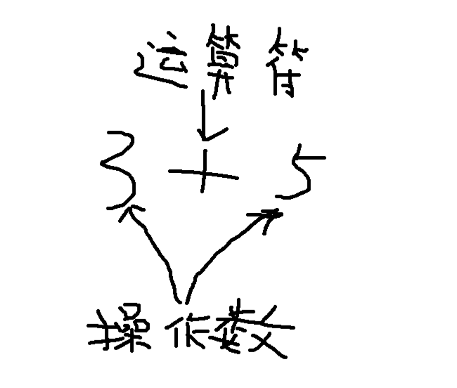

# 跟黄哥学习python第四章

# 表达式和语句（环境python 3.5）

黄哥箴言：过渡沉迷于语法，容易陷入钻牛角尖，学习编程要适当不求甚解一下。

## 表达式是一个简单的数值（常量或变量）或由运算符和值组合能产生值的操作。
   表达式都有一个值，最简单的一个表达式为一个值，如3，3.9。
   复杂的表达式由一些复杂的值和运算符组合起来的。
   在python  if 语句中 if 后面跟单一变量，这个变量也是一个表达式。    

		>>> n = 3
		>>> if n:
		...    print("n > 0")
		...
		n > 0
		>>>

## 运算符是一种特殊的符号（如，+,-,*等），用来对一个值或多个数值的特殊运算。

算术运算符   
＋ 进行加法运算    
	>>> 3 + 5
	8

\- 减法 35 － 20     
＊ 乘法 3 ＊ 3     
／ 除法 python 3 中 9 / 3 结果为 3.0 如果想和python 2 一样进行地板除(建议搜索一下何为地板除)，那么需要这样, 9 // 3    
// 地板除 9 // 2 结果为4    
** 乘方 2 ＊＊ 3 结果为 8。相当于import math  math.pow(2, 3)。   
% 取余或取模运算符，即求出除法后的余数。   

## 语句   
   python语句是一段可执行代码。常见的有赋值语句，if 语句， while 语句，for 语句，return 语句等等。

	>>> x = 3 # 赋值语句
	>>> y = 3
	>>> id(x)
	4329842800
	>>> id(y)
	4329842800
	>>> type(y)
	<class 'int'>
	>>> y
	3
	>>> x
	3

赋值语句 x = 3 是这样理解的，内存中为对象3，分配一段内置地址，将整型对象3的引用赋值给x。
x中保存对象3的应用。可以用type()函数,取得变量y引用的对象的类型。
id()函数取得变量y引用的对象的内存地址。
常用id()取得的地址是不是相同，来判断不同的变量是不是对同一个对象的引用。
print(x) 可以输出变量x引用对象的值。
至于语言是怎么设计的，就需要不求甚解一下。    

总结一下：对象有3个属性，身份，用id()取得；类型，用type()取得，值，print()输出取得。

#本章还在续写中........

如果你感觉黄哥的文章对你有帮助请打赏，支付宝账号：18610508486@163.com

[跟黄哥学习python第四章](learn_python_follow_brother_huang_4.md)

[点击黄哥python培训试看视频播放地址](https://github.com/pythonpeixun/article/blob/master/python_shiping.md)

[黄哥python远程视频培训班](https://github.com/pythonpeixun/article/blob/master/index.md)  

    