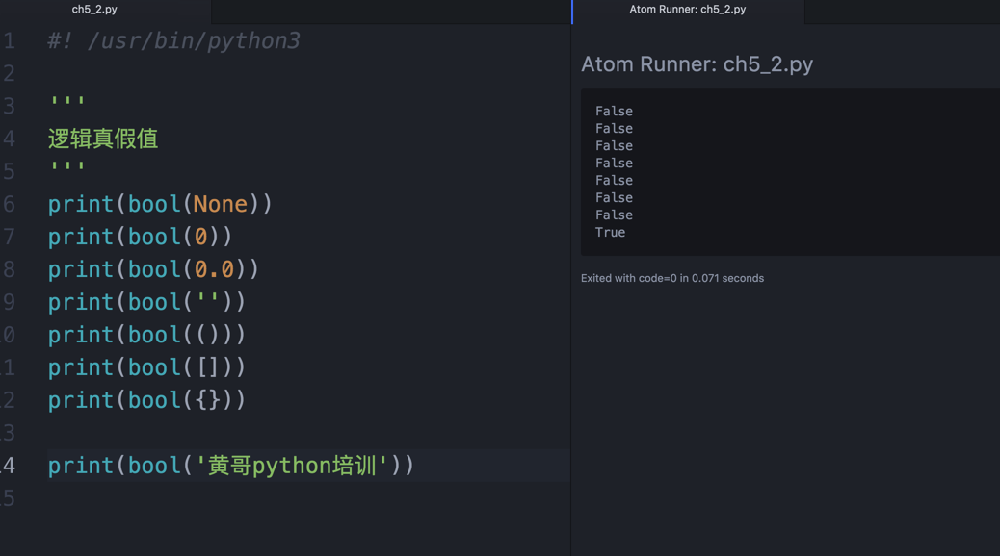

# 跟黄哥学习python第五章

# 顺序结构、判断结构，循环结构

#顺序结构
顺序结构的程序设计是最简单的，只要按照解决问题的顺序写出相应的语句就行，它的执行顺序是自上而下，依次执行。    
通俗一点的说法，就是代码从上到下一行一行的执行。    
请看下面求圆面积代码，代码中，请注意，乘法的优先级高于乘法，所以乘法放前面后面都可以。    

如果只有顺序结构，这样程序的灵活性不够，能解决的问题太少，计算机科学家设计编程语言的时候，设计了可以做选择的判断结构
和可以反复做一件事儿的循环结构。

#判断结构（选择结构）
人生充满着选择，重要时刻，判断准确，选择着正确的方向，会少走很多弯路。    
很多朋友，学习编程，选择了python，是不是经过比较选择的结果。    

#布尔表达式（逻辑表达式）
布尔表达式是一个能计算出一个布尔值True或False的表达式。

## 布尔类型
布尔类型的类型名是bool类，这个类型只有两个字面量 True 和 False（注意大小写形式），   
它们表示两个逻辑常量，True 计算出 True（表示逻辑值“真”），   
False 计算出 False（表示逻辑值“假”）。   

python中任何对象，在if 语句，while 语句，或逻辑操作符中，都可以检测出真假值。   

下面的值，都会被检测出一个为假的值。   
None，False，0, 0.0,空字符串'', 空元组(), 空列表[]， 空字典{}。   
instances of user-defined classes, if the class defines a __bool__() or __len__() method, when that method returns the integer zero or bool value False.   
除上面的以外，都为真。   
是真还是假，用bool类检测一下，就知道！    

## 比较运算符(也称关系运算符)    

	运算符	含义
	<	小于
	<=	小于等于
	>	大于
	>=	大于等于
	==	相等
	!=	不想等
	is	是不是同一个对象
	is not	negated object identity

	x < y < z 想当于 x < y and y < z
	比较运算符的结果有一个真假值。
	>>> 3 < 4
	True
	>>> 3 > 4
	False

## 逻辑运算符    

	Boolean Operations — and, or, not

	运算符(Operation)	    计算结果(Result)	     优先级
	x or y	if x is false, then y, else x	     (1)
	x and y	if x is false, then x, else y	     (2)
	not x	if x is false, then True, else False (3）

	逻辑运算符优先级，not 最高，and 第二， or 第三。
	not 运算符优先级低于其它非逻辑运算符，not a == b 相当于 not (a == b),
	如果写成 a == not b 就会报语法错误。
	逻辑短路，计算2个值和一个逻辑运算符组成的表达式。
	x or y 只有当 bool(x) 为False时，才会计算后面的y，否则直接得出表达式的值。
	下面的代码发生短路情况，0为除数不合法，但发生短路，3/0没有被计算。
	>>> 1 or 3 / 0   
        1
	x and y 只有当 bool(x) 为True时，才会计算后面的y。
	下面的代码发生短路情况
	>>> 0 and 3 / 0
        0

    特别提示：初学者在布尔表达式中，有几个纠结。
    有的朋友说，下面这样的表达式为啥不发生短路。为啥结果不是0，而是[]
    >>> 0 and 3 / 0 or None and 1 or []
       []
    黄哥的解答是，逻辑短路，计算2个值和一个逻辑运算符组成的表达式，0 and 3 / 0 发生了短路，
    0 and 3 / 0计算结果为0，但整个表达式求值没有完，要继续计算 0 and 3 / 0 or None and 1 or [] 变为
    0 or None and 1 or [],前面说了and 优先级高于or,0 or None and 1 or []相当于
    0 or (None and 1) or [],进一步简化，0 or None or [],再看上面
    x or y	if x is false, then y, else x， 所以0 or None or [] 计算为None or []
    最后结果为[]

    第二个纠结是：
    >>> 3 and 4
       4

    结果为4，有的朋友纠结说，为啥不是True。
    文档上说了x and y	if x is false, then x, else y。

如果你感觉黄哥的文章对你有帮助请打赏，支付宝账号：18610508486@163.com

[跟黄哥学习python第六章](learn_python_follow_brother_huang_6.md)

[点击黄哥python培训试看视频播放地址](https://github.com/pythonpeixun/article/blob/master/python_shiping.md)

[黄哥python远程视频培训班](https://github.com/pythonpeixun/article/blob/master/index.md)  

    